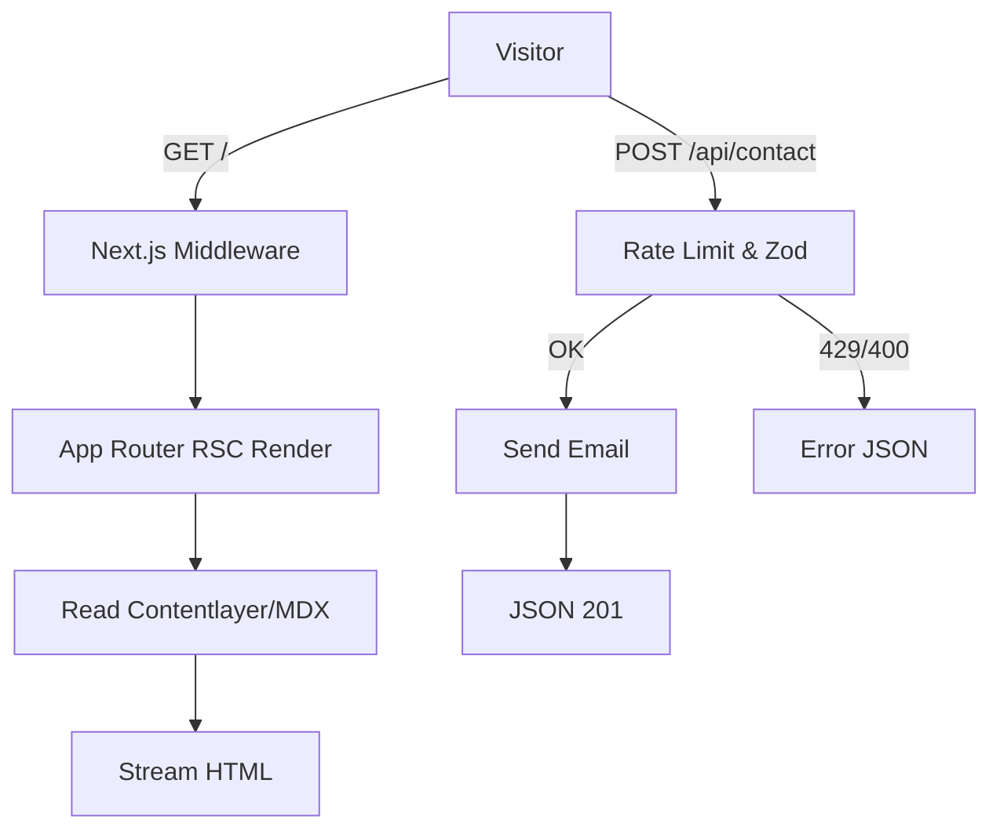

# Fatih Ünal Personal Website – Next.js 15.4 Development Plan & Integration Guide

This document adapts your existing technical architecture (single-page, minimal, fast) to **Next.js 15.4 App Router** and Server Components (RSC), and prepares the project for future expansions (portfolio, blog, admin) with minimal rewrites. Development will use **Bun + bunx** for faster tooling, while deployment can run on **Node.js (Coolify)** or Bun if desired.

---

## 1) Purpose & Scope

* **Goal:** Build a minimal single-page site using Next.js 15.4 features (App Router, RSC, Server Actions, Cache/Revalidate) while keeping the application ready for future needs such as database, authentication, and CMS.
* **Priorities:** Performance (<1s), accessibility (WCAG 2.1), SEO, simple design, easy deployment (Coolify), and basic security (HTTPS + headers).

---

## 2) Technology Stack

* **Framework:** Next.js 15.4 (App Router, React 18 RSC, Suspense, streaming)
* **Runtime:** Bun (development, via bunx), Node 20 (production). Bun runtime optional for deployment.
* **Styling/UI:** Tailwind CSS, shadcn/ui, Lucide Icons, Framer Motion
* **Theme:** `next-themes` (SSR-friendly dark/light mode)
* **Content:** MDX + Contentlayer (project posts), `next/image` for optimized images
* **Analytics:** Google Analytics (GA4)
* **Deployment:** Docker → Coolify (automatic build & deploy), Let’s Encrypt SSL
* **(Optional/Future):** ORM (Prisma or Drizzle), Auth (Auth.js/NextAuth), Email (Resend), Rate limiting (Upstash)

---

## 3) Project Initialization (with Bun)

```bash
bunx create-next-app@latest my-app --ts --app --eslint --tailwind
cd my-app
bun install
```

---

## 4) NPM Scripts (bunx-based)

```json
{
  "scripts": {
    "dev": "bunx next dev",
    "build": "bunx next build",
    "start": "bunx next start",
    "lint": "bunx next lint",
    "typecheck": "tsc --noEmit",
    "test": "bunx vitest",
    "e2e": "bunx playwright test"
  }
}
```

---

## 5) Recommended Directory Structure (App Router)

```
root/
├─ app/
│  ├─ (marketing)/
│  │  ├─ page.tsx
│  │  ├─ loading.tsx
│  │  └─ error.tsx
│  ├─ projects/
│  │  ├─ page.tsx
│  │  └─ [slug]/page.tsx
│  ├─ api/
│  │  ├─ contact/route.ts
│  │  └─ revalidate/route.ts
│  └─ layout.tsx
├─ components/
├─ content/
├─ lib/
├─ public/
├─ styles/
├─ next.config.ts
├─ tailwind.config.ts
└─ middleware.ts
```

---

## 6) Content Model (MDX Example)

```md
---
title: "Modern Next.js Portfolio"
slug: "modern-nextjs-portfolio"
date: "2025-08-01"
description: "Lightweight portfolio using RSC, MDX and shadcn"
tags: ["nextjs", "rsc", "tailwind"]
cover: "/images/portfolio/modern-nextjs.png"
github: "https://github.com/username/repo"
live: "https://site.com/project"
---
```

---

## 7) UI/UX Principles

* Minimal, focused components (Hero, Skills, Contact, Portfolio)
* shadcn/ui for consistent design; Framer Motion for micro-interactions
* Accessibility: semantic HTML, focus states, aria attributes
* Optimized images (`next/image`) with alt texts
* Fonts via `next/font` (self-hosted)

---

## 8) SEO & Metadata

* Use App Router Metadata API for titles/OG data
* Auto-generate sitemap/robots.txt
* Canonical URLs and favicons

---

## 9) Data Fetching & Revalidation

```ts
// app/projects/page.tsx
export const revalidate = 3600;
export default async function ProjectsPage() {
  const projects = await getAllProjects();
  return <ProjectsList projects={projects} />;
}
```

---

## 10) Contact Form

* **Option A (Route Handler):** `/api/contact` with Zod validation, honeypot, rate limiting, Resend email
* **Option B (Server Action):** `"use server"` function for direct submission

---

## 11) Authentication (Future)

* Auth.js with GitHub/Google or credentials
* Protect `/admin` routes via middleware

---

## 12) Database (Future)

* Prisma (SQLite → PostgreSQL migration path)

```prisma
model Project {
  id        String   @id @default(cuid())
  slug      String   @unique
  title     String
  description String
  tags      String[]
  cover     String?
  github    String?
  live      String?
  createdAt DateTime @default(now())
}
```

---

## 13) Middleware & Security

* Rate limiting (Upstash) for API endpoints
* Security headers (CSP, X-Frame-Options, etc.)
* CORS closed unless explicitly needed

---

## 14) Performance

* Minimal client-side JS, RSC usage
* Lighthouse target: Perf ≥ 95, SEO ≥ 95

---

## 15) Testing & Monitoring

* Vitest + Testing Library for unit tests
* Playwright for E2E
* Sentry for error monitoring (optional)

---

## 16) Deployment (Coolify + Docker)

* Dockerfile with `bun install && bunx next build`
* Deploy on Node.js 20 or Bun runtime
* Automatic CI/CD with git push
* SSL via Let’s Encrypt

---

## 17) Environment Variables

```
NEXT_PUBLIC_SITE_URL=https://fatihunal.dev
NEXT_PUBLIC_GA_ID=G-XXXXXXXXXX
RESEND_API_KEY=...
MAIL_TO=contact@fatihunal.dev
REVALIDATE_TOKEN=supersecrettoken
```

---

## 18) Roadmap

* Phase 1: Core (layout, theme, GA, SEO)
* Phase 2: Content (MDX portfolio)
* Phase 3: Contact + security
* Phase 4: Deployment + monitoring
* Future: Auth + DB

---

## 19) High-Level Flow



---

## 20) Notes

* Use Bun for local development speed, Node or Bun for production.
* Start with static + RSC, expand with API/DB/Auth later.
* Server Actions reduce extra fetches for forms but require rate limiting.


